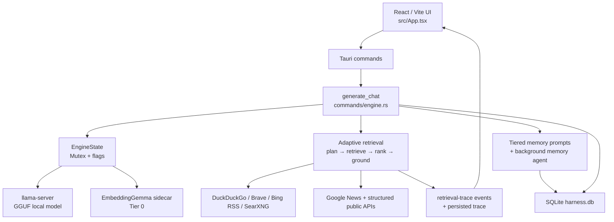

# AI Harness — สถานะระบบ, ปัญหาที่พบ, และข้อมูลสำหรับวางแผนแก้ไข

> สถานะเอกสาร: 22 กรกฎาคม 2026  
> ขอบเขต: checkout `C:\Users\Newsk\Downloads\Aphelion` ที่กำลังพัฒนาอยู่ (ยังมีการเปลี่ยนแปลงที่ไม่ได้ commit)  
> วิธีอ่าน: **ยืนยันแล้ว** หมายถึงตรวจจากโค้ดหรือทดสอบจริงแล้ว; **ต้องออกแบบ/ตรวจเพิ่ม** คือความเสี่ยงที่ยังไม่มีหลักฐานว่าแก้ได้ครบทุกกรณี

## 1. สรุปสำหรับใช้วางแผน

AI Harness เป็น desktop application แบบ local-first: หน้าจอ React/Vite เรียกคำสั่ง Tauri ไปยัง Rust backend ซึ่งรันโมเดล GGUF ผ่าน `llama-server` ในเครื่อง มีระบบ chat แบบ stream, session SQLite, memory หลายชั้น, retrieval จาก web/API, และ EmbeddingGemma สำหรับจัดประเภทและจัดอันดับข้ามภาษา

Core feature หลักมีอยู่แล้วและใช้งานได้ในระดับพื้นฐาน แต่ยังไม่ควรเรียกว่า retrieval หรือ memory “สมบูรณ์” เพราะความน่าเชื่อถือของ provider ภายนอก, เกณฑ์ embedding, lifecycle ของ memory และการตรวจความปลอดภัยยังต้องออกแบบเป็นระบบมากขึ้น

เหตุการณ์ล่าสุดยืนยันปัญหาสำคัญ: คำถาม `วันนี้ AI อะไรเปิดตัว` เคยได้รับข่าว Tesla ที่เพียงมีคำว่า AI ทั้งที่ไม่ตอบคำถาม ผู้ให้บริการ DuckDuckGo ล้มเหลว, Brave ถูก rate-limit และ Bing RSS คืนหน้าเว็บข่าวทั่วไป การแก้ไขปัจจุบันเปลี่ยนให้ตัดหลักฐาน Tesla ที่ได้ semantic score `0.226` ออก และตอบอย่างตรงไปตรงมาว่าไม่มีหลักฐานปัจจุบันที่ใช้งานได้ แทนการสรุปจากแหล่งที่ไม่ตรงเจตนา

## 2. ภาพรวมโครงสร้างที่ทำงานอยู่

### 2.1 Frontend

- `src/App.tsx` เป็น state machine ของ model picker, chat, session, stream, citations, context usage และ trace UI
- `src/lib/local-chat.ts` รับ event จาก Tauri:
  - `engine-token` สำหรับข้อความ stream
  - `engine-trim` สำหรับลบข้อความส่วนท้ายเมื่อพบ output loop หรือแก้ draft
  - `engine-status` สำหรับสถานะ pipeline
  - `retrieval-trace` สำหรับรายละเอียด API, URL, ผลดิบ, การคัดออก และคะแนน
- Chat ที่เปิดย้อนหลังโหลดทั้งข้อความ, citations และ `retrievalTrace` กลับมาจาก SQLite
- trace เปิดดูได้ใต้ `Writing response`; URL ที่คลิกได้ถูกจำกัดให้เป็น `http/https`

### 2.2 Tauri/Rust command layer

คำสั่งสาธารณะหลักอยู่ใน `src-tauri/src/lib.rs` และ `src-tauri/src/commands/`

| กลุ่ม | ความสามารถ |
|---|---|
| Models | ค้นหา/ดาวน์โหลด/ตรวจไฟล์ GGUF และดู model ที่ติดตั้ง |
| Engine | ตรวจ hardware, บันทึก settings, start/stop engine, cancel generation, ส่ง chat |
| Sessions | สร้าง/ค้นหา/เปิด/เปลี่ยนชื่อ/ลบ session และสร้าง title |
| Window | ย่อ/ขยาย/ปิด/ลากหน้าต่าง |

`EngineState` เก็บ handle ที่ใช้งานร่วมกัน: local LLM engine, conversation memory, memory-agent queue, embedding runtime, time authority, cancellation flag และ generation activity flag

### 2.3 Local model runtime

- รัน GGUF ด้วย `llama-server` เป็น local sidecar
- เลือก backend `auto | cpu | cuda | vulkan | sycl`; ค่าเริ่มต้น GPU offload คือ `-1` (เต็มที่เมื่อ GPU backend ใช้ได้)
- เริ่ม embedding sidecar แยกต่างหากด้วย EmbeddingGemma `embeddinggemma-300M-Q8_0.gguf` บน localhost CPU
- การดาวน์โหลด embedding model ครั้งแรกต้องมี network; หลังจากนั้นใช้ไฟล์ใน local model storage
- การตั้งค่าเก็บที่ app data เป็น `engine-settings.json`; memory และ embeddings เปิดเป็นค่า default

## 3. ลำดับการทำงานของ 1 ข้อความ

1. Frontend สร้าง/เลือก session แล้วส่ง user message ไป `generate_chat`
2. Backend บันทึก user message ใน SQLite และ rehydrate ประวัติจากฐานข้อมูล
3. Tier 0 embeddings วิเคราะห์ข้อความ:
   - แยก greeting/no-search และ session constraint เมื่อ confidence สูง
   - เลือก candidate provider ได้สูงสุด 2 ตัวด้วย semantic similarity
4. หาก Tier 0 ไม่ตัดสินชัด ใช้ Tier 1 local LLM classifier สำหรับ `needs_search` และ constraint
5. หากเป็นคำถาม factual/current จะสร้าง `QueryPlan` และเรียก adaptive retrieval
6. ประกอบ prompt ของ memory: short-term constraints, mid-term session memory และ long-term facts ที่เกี่ยวข้อง
7. สร้างคำตอบแบบ stream ผ่าน context manager และ `llama-server`
8. Repetition guard ตรวจ output Unicode ที่ประกอบแล้ว; ถ้าพบ loop จะ trim tail และ retry/stop ตาม recovery logic
9. ตรวจ active constraints; หากคำตอบละเมิด จะสร้าง correction pass ได้ 1 รอบ
10. หาก retrieval ทำงานแต่ไม่เหลือหลักฐานที่ใช้ได้ จะ replace draft ด้วยคำตอบ no-evidence ที่ชัดเจน
11. บันทึก assistant message, citations และ retrieval trace ลง SQLite แล้ว enqueue งาน memory เบื้องหลัง

## 4. Web/API retrieval ที่มีอยู่

### 4.1 Provider และ fallback

General web search ใช้ keyless public surfaces:

1. DuckDuckGo HTML เป็น primary
2. Brave Search HTML เมื่อผลจาก DuckDuckGo น้อยหรือเรียกไม่ได้
3. Bing RSS เมื่อยังไม่มีผลพอ
4. SearXNG: `AI_HARNESS_SEARXNG_URL` หากกำหนดไว้ แล้วตามด้วย `searx.be` และ `search.ononoki.org`

Structured/public providers ที่ runtime รองรับ:

- Wikipedia, Wikidata, arXiv, Semantic Scholar
- CoinGecko, Open-Meteo, OpenStreetMap, REST Countries, ExchangeRate
- GitHub, Stack Exchange, NVD
- Google News RSS

ระบบจำกัด active provider, fallback และ deadline เพื่อไม่ให้คำถามเดียวค้างทั้งแอป โดยใช้ web search เป็น baseline แม้ planner จะเลือก structured API

### 4.2 ขั้นตอน retrieval ปัจจุบัน

1. เก็บ `retrieval query` ที่จะส่งจริงลง trace
2. เรียก provider แบบขนานตาม resource limit
3. เก็บ raw results **ก่อน** filtering รวมถึง URL/title/snippet
4. ตัด duplicate/host ซ้ำ/เกิน result budget แล้ว scrape เนื้อหา
5. rank ข้อความจาก web ด้วย Tier 0 embeddings (fallback BM25 หาก embedding ใช้ไม่ได้)
6. รวมหลักฐานจาก API และ web แล้ว semantic-rerank อีกครั้ง
7. สำหรับ retrieval ที่มี Google News ใช้ relevance floor `0.45`; คำถามทั่วไปใช้ `0.30`
8. บันทึกทุกผลว่า `kept for answer context` หรือ `discarded as insufficiently relevant` พร้อม score
9. สร้าง grounding prompt และ citation source IDs

### 4.3 Transparent retrieval trace

ทุกข้อความที่มี retrieval เก็บ `retrieval_trace` เป็น JSON ในคอลัมน์ `messages.retrieval_trace` ซึ่งประกอบด้วย:

- query ที่ส่งจริงและ planned providers
- public endpoint ที่เรียก, สำเร็จ/ล้มเหลว และ error ที่ปลอดภัยต่อการแสดงผล
- raw web candidate ก่อน filtering
- ผลคัดเลือกเพื่อ scrape และเหตุผลที่ทิ้ง
- API result ก่อน final rerank
- score จาก Tier 0 final relevance filter
- source ที่เข้าสู่ answer context จริง

ไม่เก็บ API key, request header หรือ secret ใน trace

## 5. ระบบความจำ (Tiered Memory)

### 5.1 ชั้นข้อมูล

| ชั้น | เก็บอะไร | เขียนเมื่อ | ใช้เมื่อ |
|---|---|---|---|
| Short-term | ข้อกำหนด/ข้อห้ามที่ยัง active ใน session | ทันทีเมื่อ classifier พบ session constraint | inject เป็น Memory Directives และ reminder ก่อนข้อความล่าสุด |
| Mid-term | goals, decisions, plan steps ของ session | turn 1 และทุก turn คู่ | inject เมื่อ session เดิมดำเนินต่อ |
| Long-term | preference, communication style, recurring project/topic, skill level | ทุก 5 turns และเมื่อจบ session | semantic retrieval ตามข้อความปัจจุบัน; communication style ถูก inject เสมอ |
| Session summary | summary ย่อของ session | session-end extraction | ใช้ rehydrate conversation memory |

### 5.2 Background memory agent

- ใช้ FIFO queue ใน process แยกจาก generation UI
- ถ้าใช้ endpoint เดียวกับ main model จะรอให้ `generation_active = false` ก่อน เพื่อไม่แย่ง inference lane
- Tier A (constraint scan) มาก่อนเสมอ, Tier B (mid-term) เป็นจังหวะ, Tier C (long-term) จำกัด cadence
- มี debug log ของ memory assembly/extraction ใน app data log directory

### 5.3 Memory safety ที่มีแล้ว

- Prompt ระบุว่า active constraints และ communication preferences เป็น authoritative
- Memory reminder ถูกวางใกล้ข้อความล่าสุดเพื่อลดการถูก context trimming ทิ้ง
- long-term extraction prompt สั่งโมเดลไม่ให้เก็บ health, politics, religion หรือ credentials
- deterministic English keyword failsafe ปฏิเสธคำต้องห้ามบางกลุ่ม

## 6. Database และข้อมูลคงอยู่

ฐานข้อมูล SQLite: `AppData/Roaming/com.pichyyy.ai-harness/harness.db`

ตารางสำคัญ:

- `sessions`, `messages`, `session_summaries`
- `active_constraints`
- `long_term_facts`
- `web_cache`

`messages` เก็บ content, finish reason, citations (`web_sources`) และ trace (`retrieval_trace`) โดยมี migration สำหรับฐานข้อมูลเก่าที่ไม่มี trace column แล้ว

## 7. ปัญหาและข้อจำกัดที่ยืนยันแล้ว

### 7.1 Web/API retrieval

| ระดับ | ปัญหา | หลักฐาน/สาเหตุ | สถานะปัจจุบัน | สิ่งที่ควรวางแผน |
|---|---|---|---|---|
| สูง | Provider public ไม่เสถียร | Live incident: DuckDuckGo ไม่มีผล, Brave HTTP 429, Bing RSS คืนเว็บข่าวไทยทั่วไป | มี fallback และ trace แล้ว แต่ยังพึ่ง provider ภายนอก | provider health score, circuit breaker, retry policy, official/API provider ที่มี credential และ SLA |
| สูง | ผลที่แค่มีคำว่า AI เคยถูกใช้เป็นหลักฐานคำถาม AI launch | Google News คืน Tesla article; score `0.226` | แก้แล้ว: current-news floor `0.45`, ผลถูก discard | สร้าง benchmark Thai/English/ภาษาถิ่น เพื่อ calibrate threshold แยกตาม intent แทนค่าคงที่เดียว |
| สูง | คำค้นเคยถูก rewrite สั้นจนเสีย intent | รอบ retry เคยมีผล generic AI ทั้งที่คำถามถาม launch วันนี้ | แก้แล้ว: retry ใช้ข้อความเดิมไม่เปลี่ยน | ออกแบบ query expansion ที่ proof ว่าคง entity/time/intent ด้วย embeddings + regression suite ก่อนเปิดใช้ใหม่ |
| กลาง | Retry มี recall จำกัด | ตอนนี้ retry เปลี่ยน retrieval plan/provider แต่ไม่ขยาย query | ถูกต้องด้าน precision แต่ค้นเจอยากขึ้นในคำถามสะกดผิด/ภาษาพูด | ใช้ multilingual query variants แบบ validated, ไม่ใช่ model rewrite อิสระ |
| กลาง | Source planner มี capability IDs แต่ structured arguments ครอบคลุมไม่หมด | weather/currency/crypto มี parameter extraction; provider อื่นจำนวนมากยังใช้ raw query | ใช้งานได้ระดับพื้นฐาน | ทำ typed argument schema ต่อ provider และ validation; ระบุ date/range/entity/source priority |
| กลาง | `web_cache` ถูกเขียนแต่ active fresh-search path ตั้ง cache เป็น empty | เห็นใน `manager.rs` ว่าบังคับ fresh retrieval ทุก factual turn | ตั้งใจป้องกันข้อมูลเก่า แต่มี storage/logic ที่ไม่ถูกใช้ | ตัดออก หรือออกแบบ offline/cache mode ที่มี TTL, provenance และ UI control |
| กลาง | ไม่มี provider reliability telemetry ระยะยาว | trace เป็น per-message แต่ไม่มี aggregate success/latency/rate-limit dashboard | มี log เฉพาะเหตุการณ์ | เพิ่ม local metrics: success rate, latency, irrelevant-result rate, fallback frequency ต่อ provider |
| กลาง | Trace โตได้เร็ว | Live trace หนึ่งข้อความเคยประมาณ 14 KB และ raw preview ถูก persist | ตรวจสอบย้อนหลังได้ดี | quota/retention, truncate policy, export/delete trace และ migration policy |
| กลาง | ไม่มี automated integration test ที่ควบคุม provider responses | Unit tests ครอบคลุม parser/logic; live behavior ยังผูก network | `cargo test` ผ่าน แต่ไม่แทน end-to-end network test | mock HTTP providers, fixtures สำหรับ rate-limit/irrelevant RSS/no evidence และ Tauri E2E suite |
| ต่ำ | เอกสาร orchestrator เดิมขัดกับ implementation | `adaptive-retrieval-orchestrator.md` ระบุ silent mode/no UI trace แต่ระบบปัจจุบันแสดง trace ตามความต้องการใหม่ | เอกสารล้าสมัย | อัปเดต spec ให้ explicit ว่า trace เป็น user-controlled transparency feature |

### 7.2 Memory และ privacy

| ระดับ | ปัญหา | หลักฐาน/สาเหตุ | สิ่งที่ควรวางแผน |
|---|---|---|---|
| สูง | deterministic sensitive-memory filter รองรับคำอังกฤษเป็นหลัก | `is_allowed_fact()` ตรวจ substring เช่น `medical`, `religion`, `password`; ข้อความไทย/ภาษาอื่นอาจไม่ถูกปฏิเสธโดย failsafe นี้ | เปลี่ยนเป็น structured sensitive-data classifier ที่รองรับหลายภาษา; default-deny เมื่อ classifier ไม่แน่ใจ; audit/redaction test corpus |
| สูง | Memory queue ไม่ durable ข้าม process | ใช้ `std::sync::mpsc` ใน RAM; ปิดแอปหรือ crash ก่อน queue drain งานอาจหาย | ทำ persistent job table + idempotency key + startup recovery + graceful shutdown drain |
| กลาง | ไม่มี UI จัดการ memory โดยตรง | ผู้ใช้ยังไม่เห็น/แก้/ลบ facts, constraints, summaries แบบ granular | ทำ Memory Center: review, edit, delete, disable layer, provenance, export/clear all |
| กลาง | ไม่มี TTL/confirmation policy ที่ชัดกับ long-term facts | facts ถูก supersede จาก semantic similarity แต่ไม่มีวันหมดอายุ/การถามยืนยัน | เพิ่ม expiry, confidence decay, confirmation timestamp และ policy ตาม category |
| กลาง | Background extraction ยังพึ่งคุณภาพ local LLM | schema parsing/fallback มีแล้ว แต่ output ที่ผิดพลาดสามารถทำให้ memory ต่ำคุณภาพ | validation per category, evidence/provenance, human review option และ test model matrix |
| กลาง | Communication style ทุกข้อถูก inject เสมอ | ดีต่อ consistency แต่มีความเสี่ยง stale/over-constraining เมื่อ preference เปลี่ยน | precedence, supersession UX และ explicit user override |

### 7.3 Generation, grounding และ runtime

| ระดับ | ปัญหา | หลักฐาน/สาเหตุ | สิ่งที่ควรวางแผน |
|---|---|---|---|
| สูง | Faithfulness checker ยังไม่บังคับผลลัพธ์ | `check_faithfulness()` ถูกเรียกหลัง generation แต่ผล `_flagged` ไม่ถูกใช้เพื่อ trim/regenerate/reject | กำหนด policy: supported claim threshold, correction pass จำกัด 1 รอบ, citation validation และ safe fallback |
| กลาง | Engine mutex ถูกถือครอบคลุม retrieval และ generation | `generate_chat` lock engine ก่อนทำ web pipeline และปล่อยใกล้ท้ายคำขอ | แยก immutable endpoint/config ออกจาก engine guard หรือใช้ command queue เพื่อให้ lifecycle/control ไม่รอ long request |
| กลาง | No-evidence response ยัง generic | ปลอดภัยกว่า hallucination แต่ขอให้ “ระบุคำถามให้เฉพาะ” โดยไม่เสนอวิธี refine ที่ช่วยได้ | ให้ planner เสนอ safe refinement เช่น product/vendor/date/region/source type โดยไม่แต่ง facts |
| กลาง | Embedding download/startup เป็น first-run dependency | EmbeddingGemma ต้องดาวน์โหลดเมื่อยังไม่มีไฟล์; fallback เป็น Tier 1 ถ้าเริ่มไม่ได้ | preflight UI, resumable download/progress, offline install/import, benchmark และ feature health indicator |
| ต่ำ | Frontend production build เตือน JavaScript chunk >500 kB | `npm run build` ผ่านแต่ Vite เตือน size | code split หน้าจอ/model catalog/markdown highlight และวัด startup time |

## 8. สิ่งที่ยืนยันว่าทำงานแล้ว

- Local model start และ streaming response ผ่าน Tauri
- SQLite sessions และการเปิดประวัติแชต
- Tier 0 EmbeddingGemma เริ่มเป็น local sidecar และใช้สำหรับ provider/relevance/memory retrieval
- Fallback Tier 1 classifier เมื่อ Tier 0 ไม่ชัดหรือไม่พร้อม
- Web/API retrieval, citation source mapping และ no-evidence guard
- Transparent retrieval trace ทั้ง live และย้อนหลัง
- Tiered memory prompt assembly และ background queue
- Constraint correction pass
- Unicode-aware repetition guard ลด output loop โดยไม่ตัด chunk ซ้ำปกติของภาษาไทย/CJK
- Current-time context และ local time authority
- Migration ของ `retrieval_trace` สำหรับฐานข้อมูลเดิม

การตรวจล่าสุด:

- `cargo test`: ผ่าน `47/47`
- `npm.cmd run build`: ผ่าน
- Live test คำถาม `วันนี้ AI อะไรเปิดตัว`: ตัด Tesla AI headline score `0.226` ออกจาก answer context และแสดง no-evidence answer อย่างถูกต้อง

## 9. แผนแก้ที่แนะนำตามลำดับ

### Phase 0 — Stabilize และเก็บ baseline

1. Freeze ชุด test cases หลายภาษา: Thai, English, code-mix, ภาษาถิ่น/typo, CJK และ Arabic
2. บันทึก fixture ของ provider failures: HTTP 429, timeout, irrelevant Bing RSS, empty HTML, malformed RSS
3. ทำ retrieval benchmark ที่วัด precision, no-evidence precision, citation correctness, latency และ provider success rate
4. อัปเดต `adaptive-retrieval-orchestrator.md` ให้ตรงกับ trace-enabled design

**เกณฑ์ผ่าน:** ทุก incident ที่เคยเกิดต้อง reproduce ด้วย mock และมี regression test ก่อนแก้ provider logic ต่อ

### Phase 1 — Retrieval correctness และ provider reliability

1. ทำ typed retrieval plan: intent, entities, date range, geography, preferred source class และ required evidence count
2. ทำ provider health registry/circuit breaker ใน local SQLite
3. ใช้ official/contracted APIs สำหรับ provider สำคัญ พร้อม config/secret management ที่ไม่แสดงใน trace
4. ทำ multilingual query expansion ที่ต้อง preserve intent ก่อนส่ง และเก็บ all variants ใน trace
5. แยก strictness ตาม intent (news/current, research, docs, generic background) จาก benchmark ไม่ hard-code โดยไม่มีเหตุผล
6. ตัด/ออกแบบ web cache ใหม่เป็น offline mode ที่มี TTL และ provenance

**เกณฑ์ผ่าน:** เมื่อ provider แรกพัง ระบบไม่ใช้ผล random; ถ้าไม่มีหลักฐานตรงเจตนา ต้อง no-evidence; ถ้ามีหลักฐาน ต้องมี citation ที่เปิดได้

### Phase 2 — Memory privacy, durability และ user control

1. เปลี่ยน sensitive-data policy เป็น multilingual structured classifier + conservative default
2. ย้าย memory jobs ลง persistent queue พร้อม retry/backoff/idempotency และ recovery หลัง restart
3. ทำ Memory Center UI พร้อม source session, confidence, edit/delete/disable/export/clear
4. เพิ่ม TTL, confidence decay, supersession และ explicit confirmation ของ facts ที่มีผลต่อคำตอบ
5. ทำ privacy test suite โดยเฉพาะภาษาไทยและ code-mixed text

**เกณฑ์ผ่าน:** ข้อความ sensitive ทุกภาษาที่ test ต้องไม่กลายเป็น long-term fact; ปิดแอประหว่าง queue ทำงานแล้วเปิดใหม่ งานต้อง resume หรือมีสถานะชัดเจน

### Phase 3 — Grounding และ model quality

1. เปลี่ยน faithfulness checker ให้ enforce correction/abstention จริง
2. ตรวจ citation coverage ต่อ factual paragraph/claim
3. แยก engine lifecycle lock ออกจาก retrieval/generation long-running path
4. เพิ่ม telemetry local-only สำหรับ repetition recovery, no-evidence rate, correction pass และ context pressure
5. code split frontend และวัด cold-start/first-token latency

**เกณฑ์ผ่าน:** claim ที่ไม่มี support ถูกแก้หรือตัด, cancel/stop responsive ระหว่าง retrieval, และ latency/quality มี dashboard หรือ export ที่ตรวจสอบได้

## 10. ไฟล์อ้างอิงสำหรับการลงแผนต่อ

| เรื่อง | จุดเริ่มอ่าน |
|---|---|
| Chat orchestration | `src-tauri/src/commands/engine.rs` |
| Local runtime / repetition | `src-tauri/src/engine/runtime.rs`, `repetition_guard.rs` |
| Tier 0 embeddings | `src-tauri/src/engine/embedding_runtime.rs` |
| Tiered memory | `src-tauri/src/engine/memory/` |
| Persistence/schema | `src-tauri/src/sessions/store.rs` |
| Retrieval plan/orchestration | `src-tauri/src/web_search/query.rs`, `orchestrator.rs`, `worker_runtime.rs` |
| Web providers/ranking | `src-tauri/src/web_search/manager.rs`, `bm25.rs`, `sources/` |
| Trace frontend | `src/App.tsx`, `src/lib/local-chat.ts`, `src/types.ts` |
| Existing architecture docs | `docs/adaptive-retrieval-orchestrator.md`, `docs/tiered-memory-system.md`, `docs/master-plan.md` |

## 11. การตัดสินใจที่ต้องตอบก่อนเริ่มรอบถัดไป

1. ต้องการให้ web search เน้น **precision/no-evidence** แบบปัจจุบัน หรือยอมรับ recall ที่มากขึ้นด้วย query expansion ที่ควบคุมได้?
2. Provider ใดเป็น critical ที่ควรใช้ official API และยอมรับการตั้งค่า key/ค่าใช้จ่าย?
3. Memory ต้องเก็บข้าม session นานเท่าใด และผู้ใช้ควร approve ก่อนบันทึก category ใดบ้าง?
4. ระดับ privacy ที่ต้องการ: local-only trace, encrypted database, retention ระยะเวลา, และ export/delete requirement
5. Faithfulness policy ต้องการ correction pass, abstention หรือทั้งสองแบบในแต่ละระดับความเสี่ยง?

